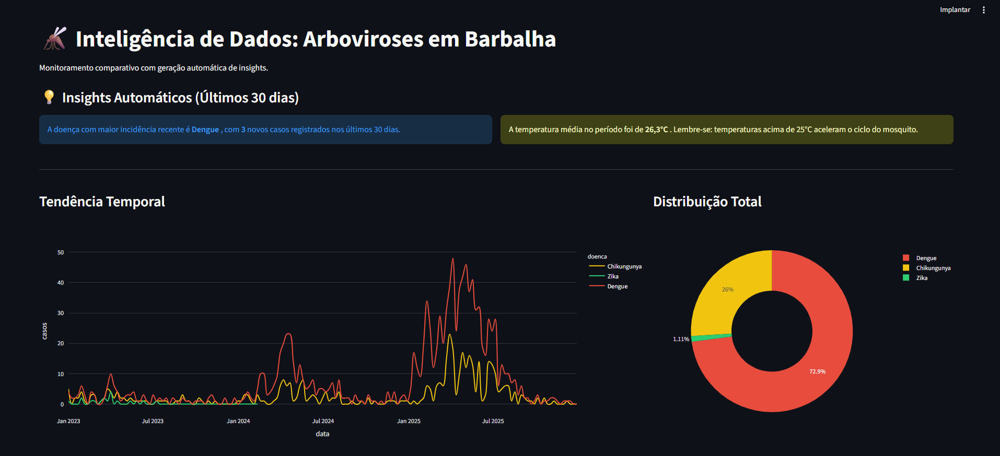

# Monitor de Arboviroses: Inteligência de Dados em Saúde

Este projeto é uma ferramenta de **Data Intelligence** desenvolvida para monitorar e comparar a incidência de Dengue, Zika e Chikungunya em Barbalha-CE. O sistema automatiza a coleta de dados epidemiológicos reais e gera insights automáticos sobre tendências e riscos climáticos.

---

## Visão Geral do Dashboard
Abaixo, a interface do painel interativo desenvolvido com Streamlit:

---

## Sobre o Projeto
O objetivo é transformar dados brutos da API **InfoDengue (Fiocruz)** em decisões estratégicas. O painel foca na análise de sazonalidade e na correlação entre fatores climáticos (temperatura/umidade) e o aumento de casos notificados.

### Principais Funcionalidades:
* **Coleta Multi-doenças**: Scripts automatizados para baixar dados de Dengue, Zika e Chikungunya.
* **Tratamento de Dados Resiliente**: Lógica preparada para variações de nomes de colunas da API (ex: `data_iniSE` vs `data_ini_se`).
* **Insights Automáticos**: O painel identifica sozinho qual doença teve maior crescimento nos últimos 30 dias.
* **Correlação Climática**: Gráficos que cruzam a temperatura média com o volume de casos.

---

## Tecnologias e Habilidades
* **Python**: Linguagem base para automação e análise.
* **Pandas**: Manipulação, limpeza e consolidação de múltiplos datasets (Engenharia de Dados).
* **Streamlit**: Framework para desenvolvimento do dashboard interativo.
* **Plotly**: Criação de gráficos dinâmicos e profissionais.
* **APIs**: Consumo de dados em tempo real via Requests.

---

## Estrutura de Arquivos
* `src/coleta_dados.py`: Script de integração com a API da Fiocruz.
* `src/app.py`: Código fonte do dashboard interativo.
* `data/`: Pasta local onde os arquivos CSV são armazenados após a coleta.
* `requirements.txt`: Lista de bibliotecas necessárias para o projeto.

